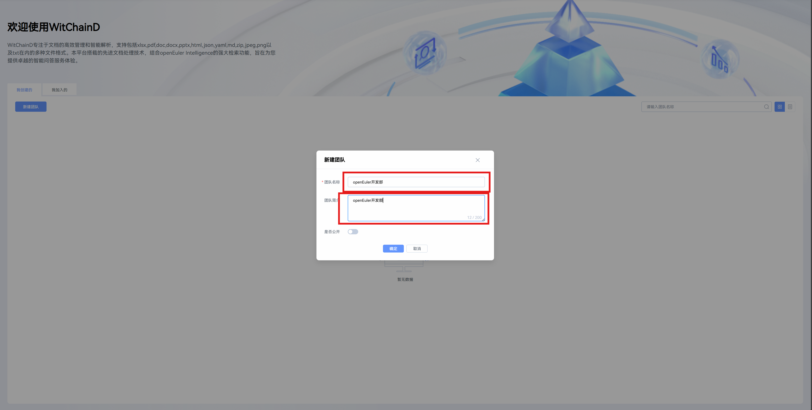
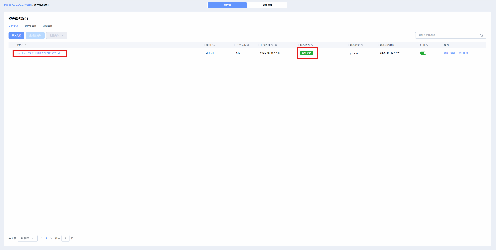
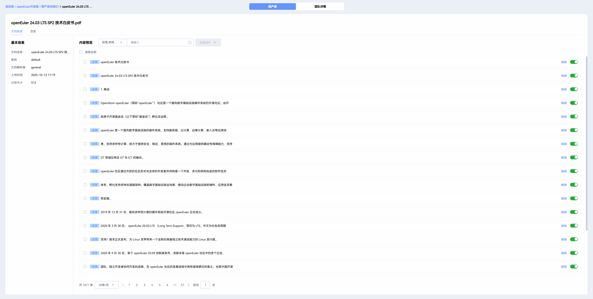
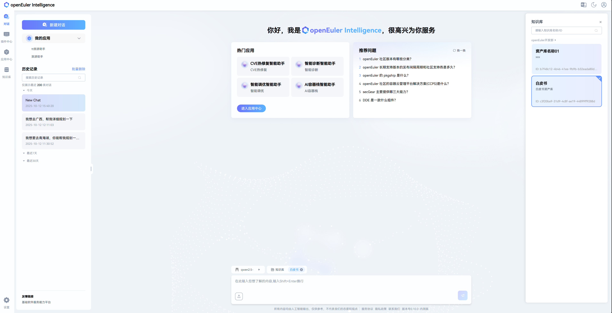
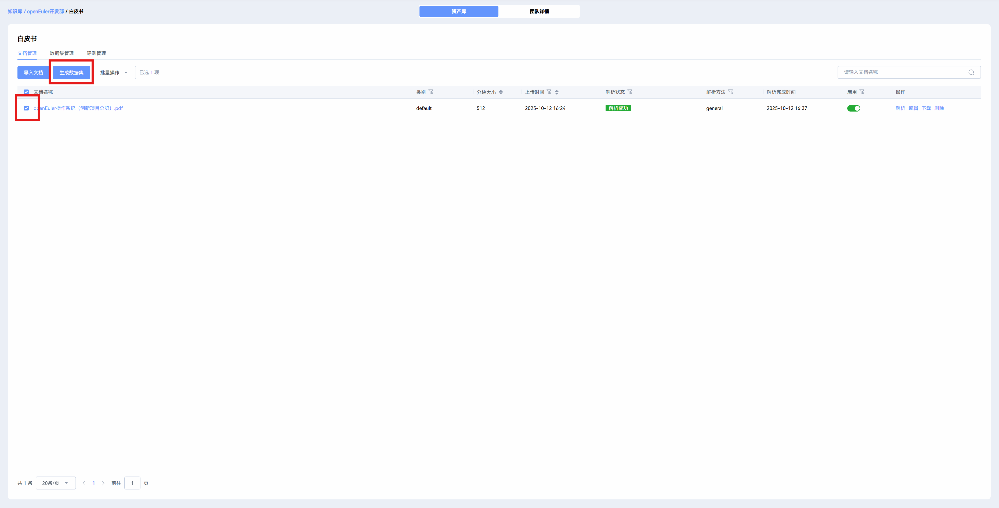
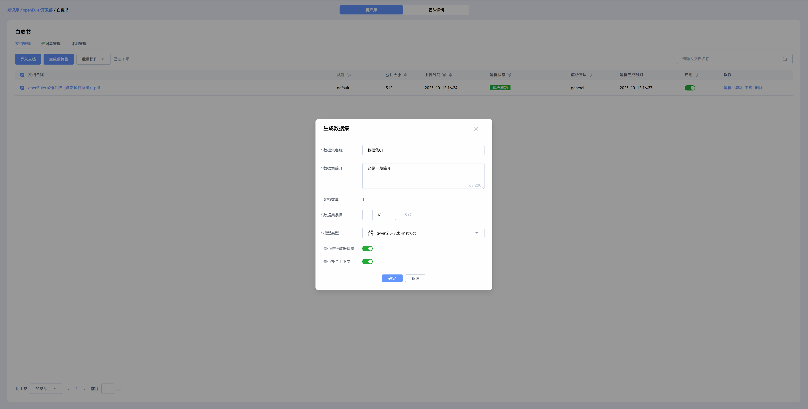
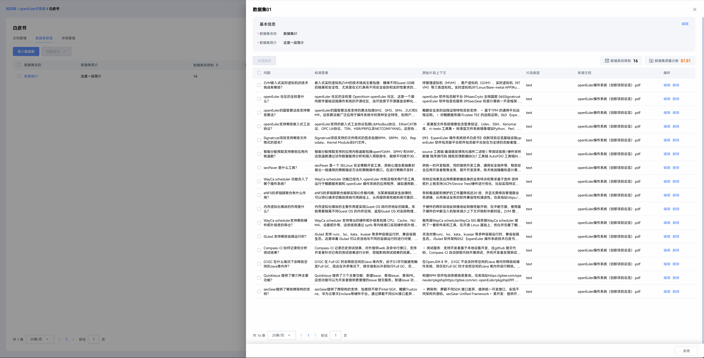
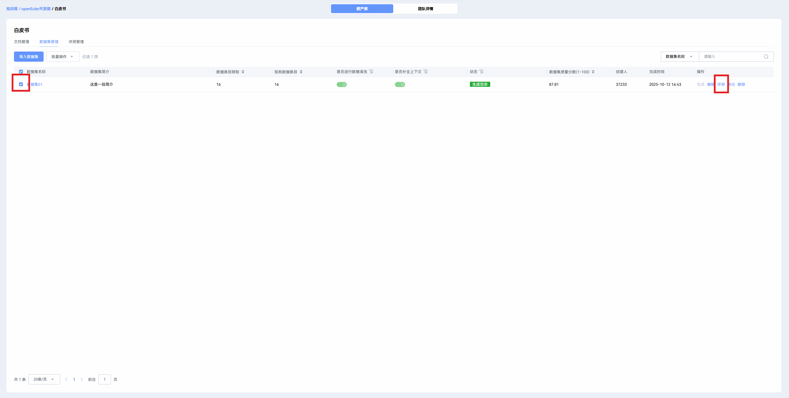
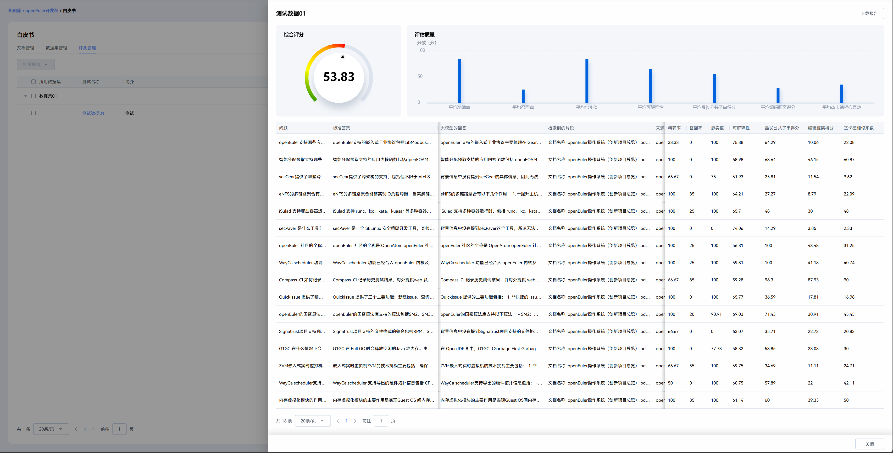

# witChainD 使用指南——知识库管理

## 1.概述

openEuler intelligence 部署完成之后，在web端页面集成了 witChainD ，可以使用 witChainD 进行知识库管理管理。下面我将介绍 withChainD 的使用。

1. 概述
2. 创建团队
3. 创建资产库
4. 上传文档
5. 生成数据集
6. 准确率测试
7. 总结

## 2.创建团队

新建团队，点击新建团队创建自己的团队，在对应框中填入团队名称和团队简介即可，可选是否公开，点击确认即可。

新建团队后会在witChainD页面显示刚创建的团队。

## 3.创建资产库

点击新创建的团队，进入**团队资产库页面**，再点击新建资产库。

填写资产库名称和简介等信息。

点击确定后会弹出是否导入文档，可以直接选择导入也可以通过点击新创建的资产库进入资产库导入文档。
新建完团队资产库后会在团队页面显示刚创建的知识库。

## 4.上传文档

点击某个资产库会进入**资产库页面**，点击导入文档，选择文件并导入（可选择导入多个文件）。

导入完成会在资产库显示刚导入的文档并解析，解析完成可对该文档进行相关操作，例如使用该文档生成数据集。

解析成功后，点击文档名称可查看文档解析情况，也可以点击解析解析重新解析，可以通过编辑设置不同解析方法。

解析结果大致如下：

上传文档后可以在openEuler intelligence中选择知识库进行对话。

## 以下补充章节

用于验证导入文档的效果和情况，帮助开发人员进行优化。

## 5.生成数据集

可以选择已导入的文档集生成数据集，勾选需要生成数据集的文档，点击生成数据集。

填写相关的信息和选择所需配置，点击生成，即可在**数据集管理页面**等待数据集的生成。

可以点击某个数据集名称即可查看数据集生成情况，结果大致如下：

## 6.准确率测试

数据集评测，勾选数据集，并点击生成**生成**

填写相关评测信息和配置，点击确定即可对所勾选数据集进行测评。

数据集测评结束后，可以点击测试名称来查看数据集测试情况，结果大致如下：

## 7.总结

基于上述流程，用户可以快速使用witChainD，欢迎体验并探索更多功能场景。