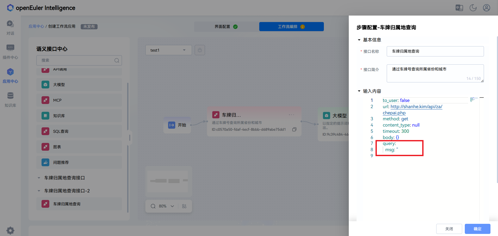

# 工作流服务指南

## 1. 概述

openEuler Intelligence 当前版本已经支持工作流的自定义创建与使用，使用流程主要分为以下几个步骤：

1. 创建语义接口
2. 创建工作流
3. 测试工作流
4. 发布工作流
5. 使用工作流
6. 编辑/删除工作流

> **说明**：
>
> - 创建、测试、发布和使用工作流为普通用户权限操作
> - 使用的浏览器为Chrome

## 2. 工作流的使用流程

以下流程以普通用户账号为例，展示工作流的完整使用流程：

1. **创建语义接口**

    > **注意**：请确保语义接口的正确性，上传后无法修改与删除。若想要重复上传相同的语义接口，请修改成不同的标题

    点击进入左侧的插件中心进入其中页面，点击搜索栏旁的 "创建插件" 按钮，并点击出现的 "语义接口"
    

    点击后在页面右侧会出现上传语义接口的窗口，可以拖入文件也可以点击 "选择文件" 来上传接口文件
    

    上传后，文本框内会显示用户上传的文件，下方也会出现 "编辑" 与 "解析" 按钮。在确认接口文件正确后，点击 "解析" 按钮
    

    解析完成后，右边会显示相应的接口路径与描述，代表已经上传成功，点击关闭即可
    

2. **创建工作流**

    点击左侧的应用中心进入其页面，点击搜索栏旁的 "创建应用" 按钮，并点击出现的 "工作流应用" ，最后点击确定，进入创建工作流的页面
    

    页面的上方有 "界面配置" 和 "工作流编排" 。"界面配置" 中可以在左侧修改界面需求，包括基本信息、对话次数、权限等；左侧为相应设置下显示的预览界面；最下方可以保存当前配置与最终发布。默认界面设置已经完成，即上方已变成绿色
    

    点击上方 "工作流编排" 按钮，进入其中页面。左侧为语义接口中心，包括系统默认提供的与用户自行创建上传的语义接口，右侧为可视化工作流编排界面，可以在其中进行工作流的编排
    
    
    点击右侧中心的 "创建工作流" 按钮，在弹窗中输入相应的工作流名称与描述，点击确定进入编排页面
    

    在编排界面中，可以将左侧所需的接口拖入，并用线将其链接，形成用户所需的工作流。若想删掉连线，鼠标移动到对应的线条，摁下 "Backspace" 即可删除；想删除接口，可将鼠标移动到接口右上 "..." ，点击删除即可。下图展示其中一种工作流
    

    若其中接口文件的query不确定，请将鼠标移动到接口右上 "..." ，点击 "编辑" ,并且将其中的query置空（修改为query: {}）。最后点击下方保存即可
    
    

3. **测试工作流**
    
    点击编排界面左上的小虫即可进入调试页面，在弹出的窗口中输入调试的语句并上传，查看输出结果。其中的各个步骤可以点击右侧箭头进行详细查看。测试成功完成后，上方的黄色表示会变成绿色
    

4. **发布工作流**

    点击下方的 "发布" 按钮后，会自动跳转到应用中心界面，此时页面中会出现用户已经发布的工作流。
    

5. **使用工作流**

    点击发布的工作流，进入对话界面。在界面中进行对话即可使用
    

6. **编辑/删除工作流**

    返回应用中心界面，已发布的工作流的右下角都会存在 "编辑" 和 "删除" 按钮，点击 "编辑" 可重新进入之前创建工作流的界面进行修改，点击 "删除" 可以删除对应的工作流
    

## 3. 总结

通过上述流程，用户可创建与使用工作流。欢迎体验并探索更多功能，也欢迎反馈各种问题。

## 4. 附录

测试使用的语义接口链接:
    [测试使用语义接口](yaml/car-plate-region.yaml)
