# 智能问答使用指南

## 开始对话

在对话区下侧输入框即可输入对话想要提问的内容，输入 `Shift + Enter` 可进行换行，输入 `Enter` 即可发送对话提问内容，或者单击“发送”也可发送对话提问内容。

> **说明**
>
> 对话区位于页面的主体部分，如图 1 所示。

- 图 1 对话区

  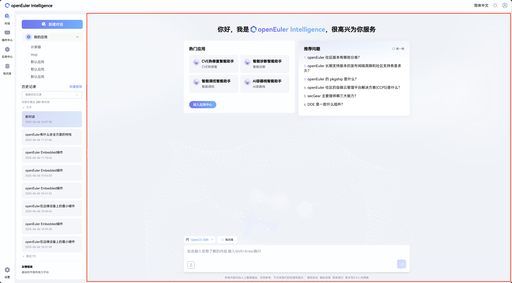
  
> **说明**
>
>知识库配置位于页面的右侧部分，如图二所示，用户可以通过配置知识库增强问答体验

- 图二 知识库配置

  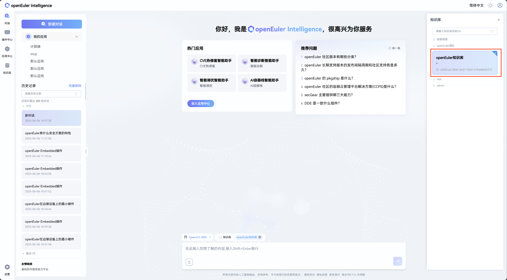

> **说明**
>
> 用户可以点击左下角的设置按钮进入模型配置页面，现提供8中供应商的基础模板用于大模型创建

- 图三 大模型创建

  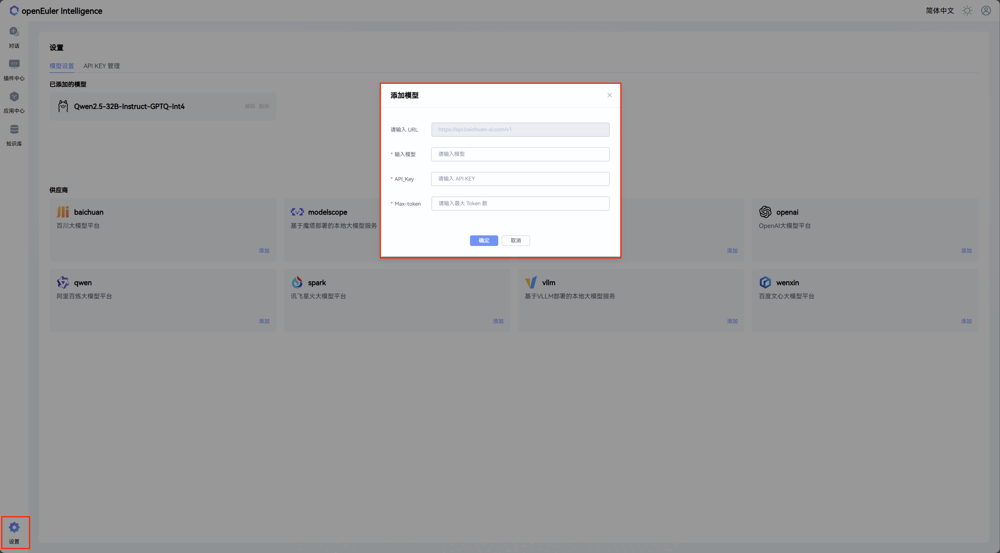

> **说明**
>
>用户可以通过左下角的下拉框选择已经配置了的模型（系统提供一个默认模型）

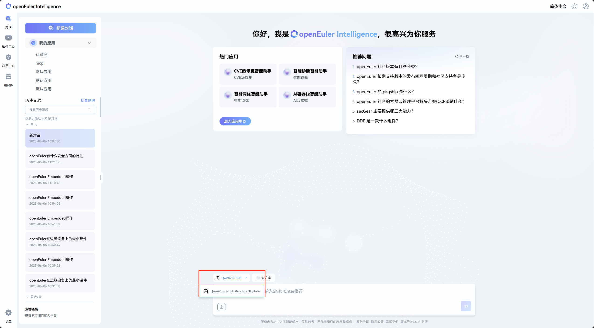

### 多轮连续对话

openEuler intelligence 智能问答支持多轮连续对话。只需要在同一个对话中继续追问即可使用，如图 4所示，openEuler intelligence会根据上下文对用户的问题进行补全。

- 图 4多轮对话
  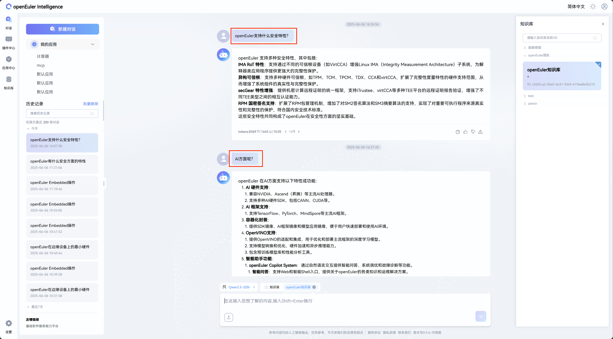

### 上传文件

**步骤1** 单击对话区左下角的“上传文件”按钮，如图 5 所示。

- 图 5 上传文件按钮
  

> **说明**
>
> 鼠标悬停到“上传文件”按钮上，会显示提示允许上传文件的规格和格式，如图 6 所示。

- 图 6 鼠标悬停显示上传文件规格提示
  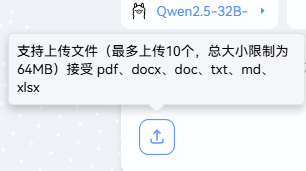

**步骤2** 在弹出的文件选择框中，选择需要上传的文件，单击“打开”，即可上传文件。最多上传10个文件，总大小限制为64MB。接受 PDF、docx、doc、txt、md、xlsx。

开始上传后，对话区下方会显示上传进度，如图 7 所示。

- 图 7 同时上传的所有文件排列在问答输入框下方
  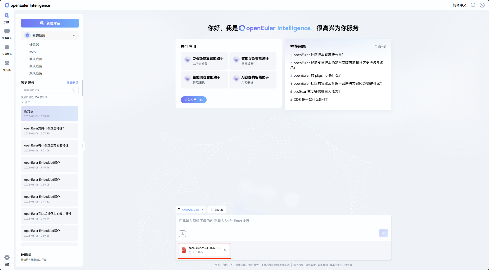

文件上传成功后，左侧历史记录区会显示上传的文件数量，如图 9 所示。

- 图 8 对话历史记录标签上会展示上传文件数量
  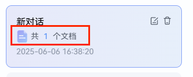

### 针对文件提问

文件上传完成后，即可针对文件进行提问，提问方式同普通对话模式，如图 10 所示。

- 图 10 询问与上传的文件相关的问题
  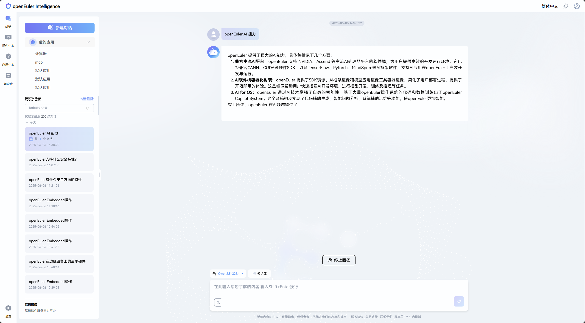

## 管理对话

> **说明**
>
> 对话管理区在页面左侧。

### 新建对话

单击“新建对话”按钮即可新建对话，如图 12 所示。

- 图 11 “新建对话”按钮在页面左上方
  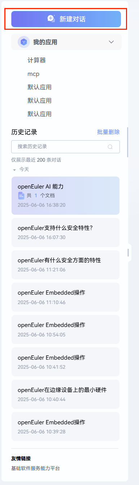

### 对话历史记录搜索

在页面左侧历史记录搜索输入框输入关键词，然后单击

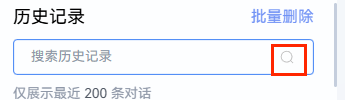

即可进行对话历史记录搜索如图 12 所示。

- 图 12 对话历史记录搜索框
  

### 对话历史记录单条管理

历史记录的列表位于历史记录搜索栏的下方，在每条对话历史记录的右侧，单击

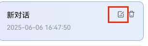

即可编辑对话历史记录的名字，如图 13 所示。

- 图 13 点击“编辑”图标重命名历史记录
  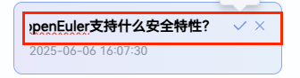

在对话历史记录名字重新书写完成后，单击右侧

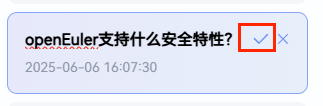

即可完成重命名，或者单击右侧

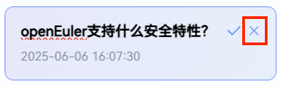

放弃本次重命名，如图 14 所示。

- 图 14 完成/取消重命名历史记录
  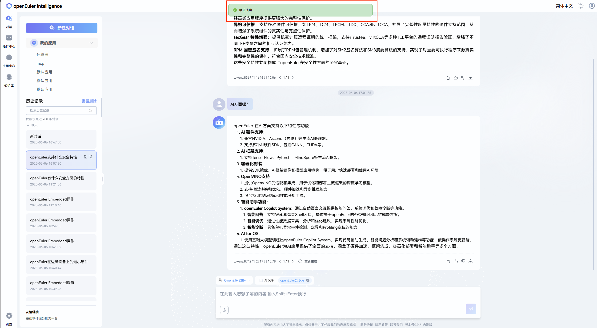

另外，单击对话历史记录右侧的删除图标，如图 16 所示，即可对删除单条对话历史记录进行二次确认，在二次确认弹出框，如图 17 所示，单击“确认”，可确认删除单条对话历史记录，或者单击“取消”，取消本次删除。

- 图 15 点击“垃圾箱”图标删除单条历史记录
  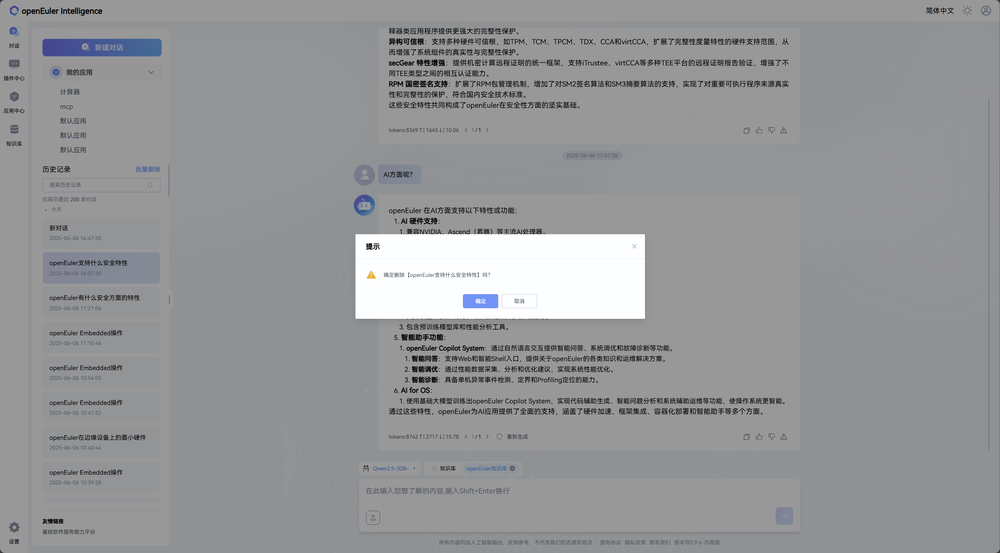

- 图 16 二次确认后删除历史记录
  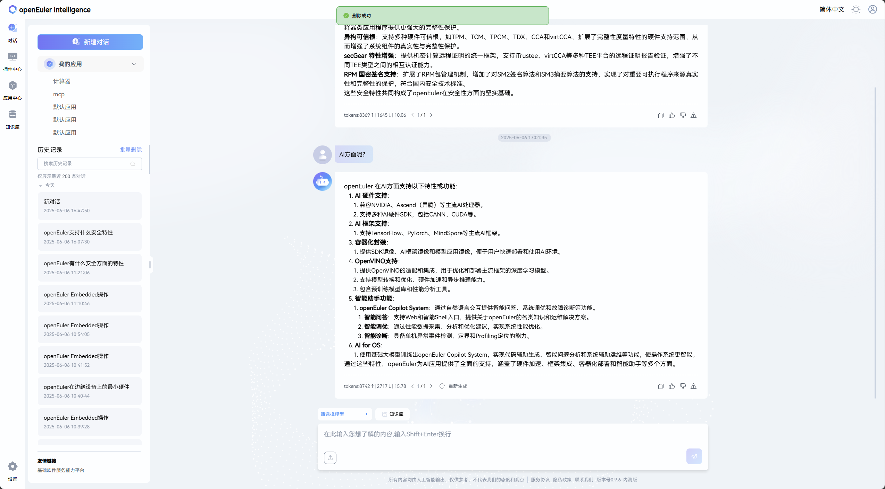

### 对话历史记录批量删除

首先单击“批量删除”，如图 18 所示。

- 图 18 批量删除功能在历史记录搜索框右上方
  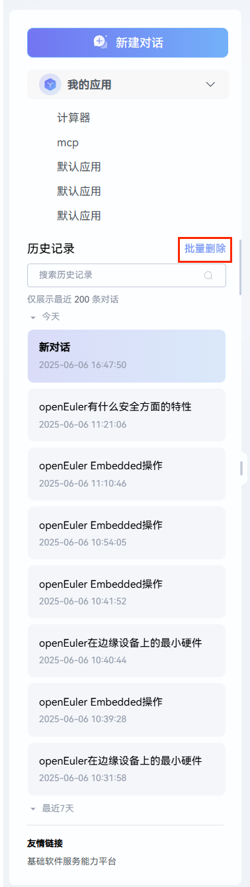

然后可对历史记录进行选择删除，如图 19 所示。单击“全选”，即对所有历史记录选中，单击单条历史记录或历史记录左侧的选择框，可对单条历史记录进行选中。

- 图 19 在左侧勾选要批量删除历史记录
  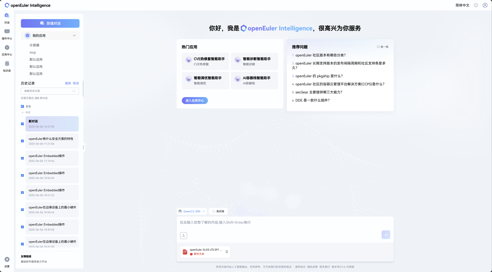

最后需要对批量删除历史记录进行二次确认，如图 20 所示，单击“确认”，即删除，单击“取消”，即取消本次删除。

- 图 20 二次确认后删除所选的历史记录
  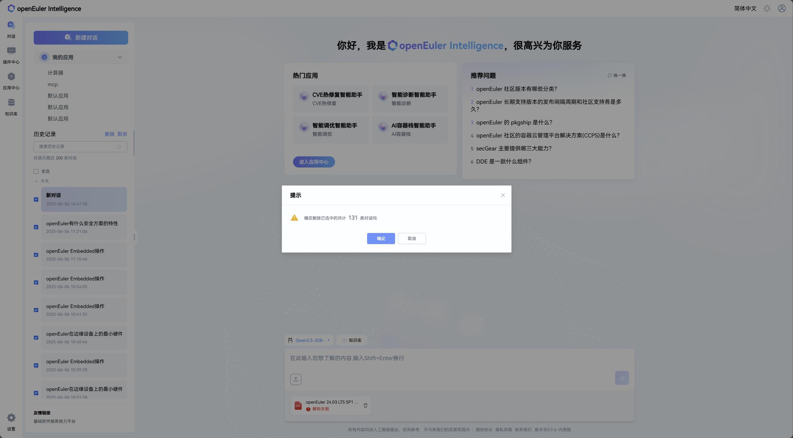

## 附录

### 用户信息导出说明

openEuler intelligence 后台存在用户信息导出功能，如用户需要，需主动通过 <contact@openeuler.io> 邮箱联系我们，运维会将导出的用户信息通过邮箱回送给用户。
