# MCP 服务指南

## 1. 概述

openEuler intelligence 当前版本对 MCP 的支持已得到增强，使用流程主要分为以下步骤：

1. 注册 MCP
2. 安装 MCP
3. 激活 MCP 并载入配置文件
4. 基于已激活的 MCP 构建 Agent
5. 测试 Agent
6. 发布 Agent
7. 使用 Agent

> **说明**：
>
> - 注册、安装和激活 MCP 需管理员权限操作
> - 构建、测试、发布和使用 Agent 为普通用户权限操作
> - 所有 Agent 相关操作均需基于已激活的 MCP 进行

## 2. MCP 的注册、安装与激活

以下流程以管理员账号为例，展示 MCP 的完整管理流程：

1. **注册 MCP**
   通过插件中心的 "MCP 注册" 按钮，将 MCP 注册到 openEuler intelligence 系统中
   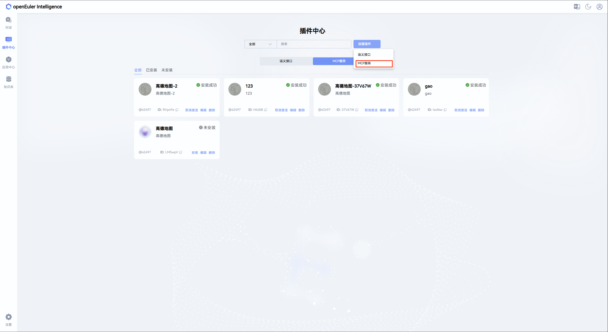

   点击按钮后弹出注册窗口（SSE 和 STDIO 的默认配置如下）：
   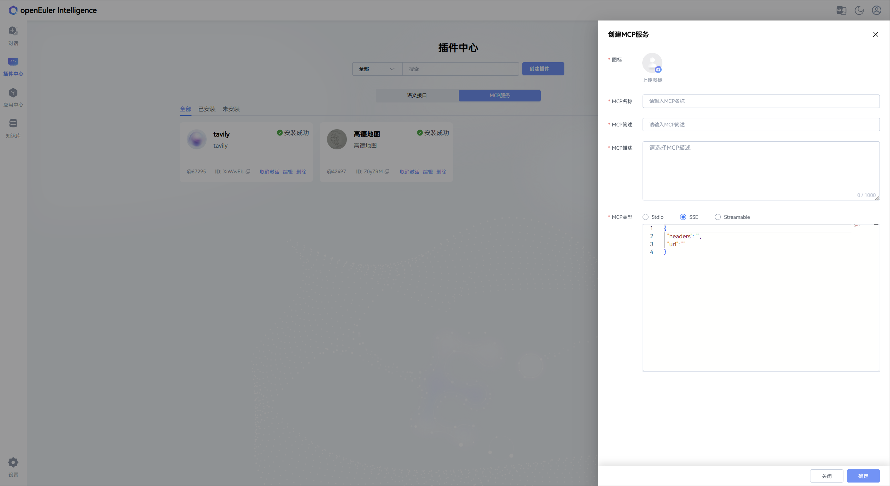
   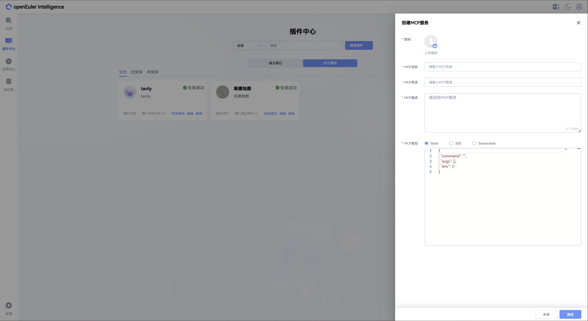

   以 SSE 注册为例，填写配置信息后点击"保存"
   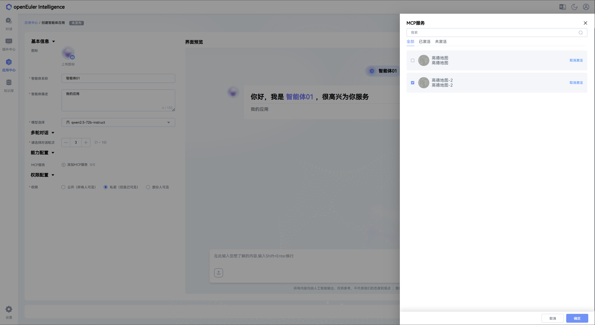

2. **安装 MCP**

   > **注意**：安装 STDIO 前，可在对应容器或服务器的 `/opt/copilot/semantics/mcp/template` 目录下调整服务依赖文件及权限

   点击已注册的 MCP 卡片上的"安装"按钮进行安装
   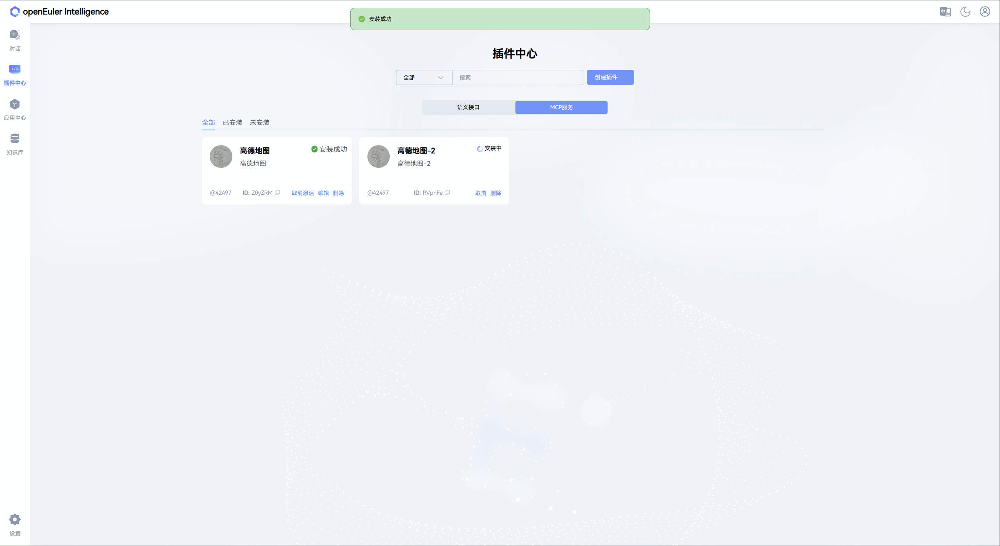

3. **查看 MCP 工具**
   安装成功后，点击 MCP 卡片可查看该服务支持的工具
   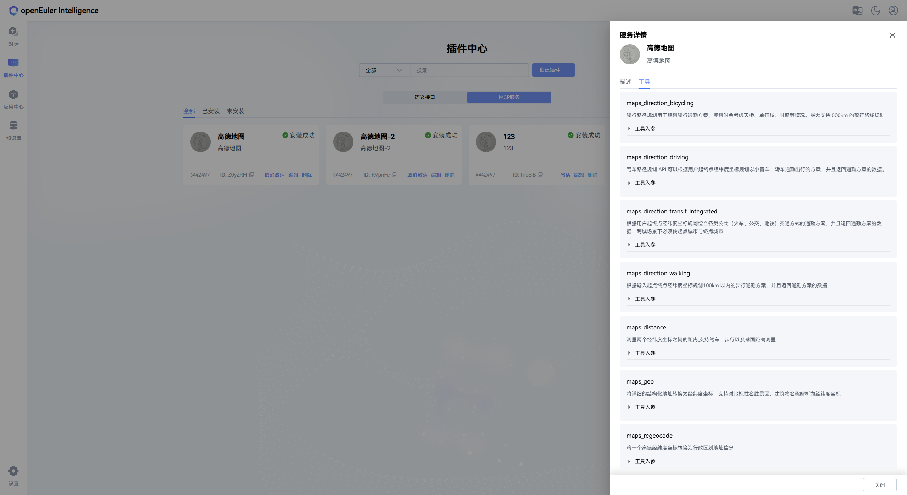

4. **激活 MCP**
   点击"激活"按钮启用 MCP 服务
   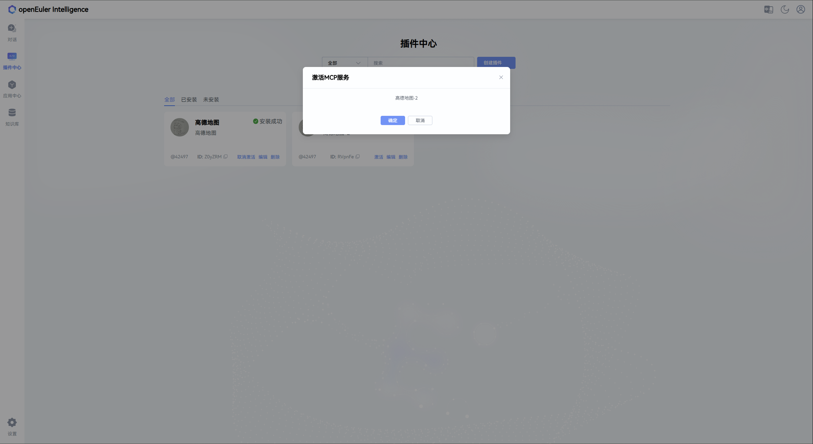

## 3. Agent 应用的创建、测试、发布与使用

以下操作可由普通用户完成，所有操作均需基于已激活的 MCP 进行：

1. **创建 Agent 应用**
   点击应用中心的"创建应用"按钮
   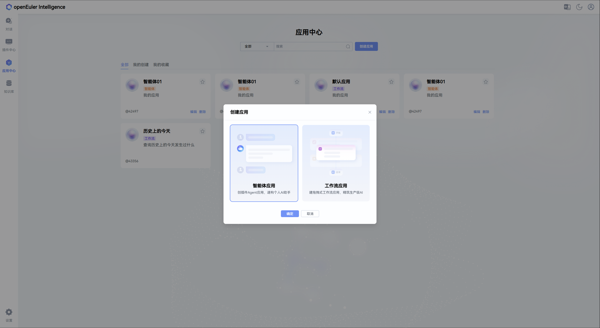

2. **配置 Agent 应用**
   创建成功后，点击应用卡片进入详情页，可修改应用配置信息
   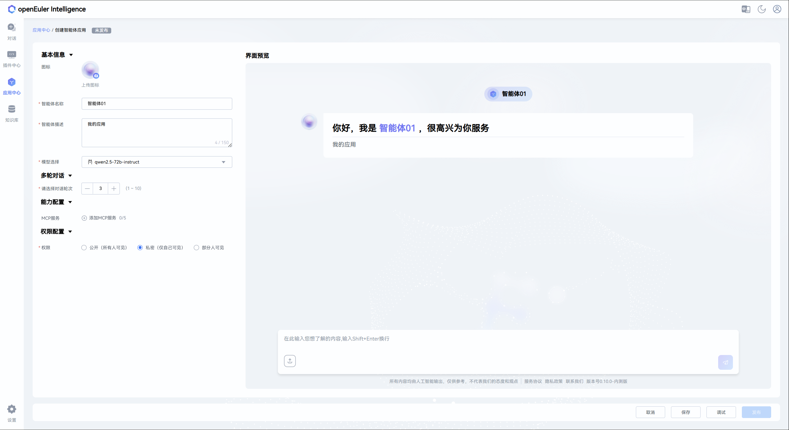

3. **关联 MCP**
   点击"添加 MCP"按钮，在左侧弹出的列表中选择已激活的 MCP 进行关联
   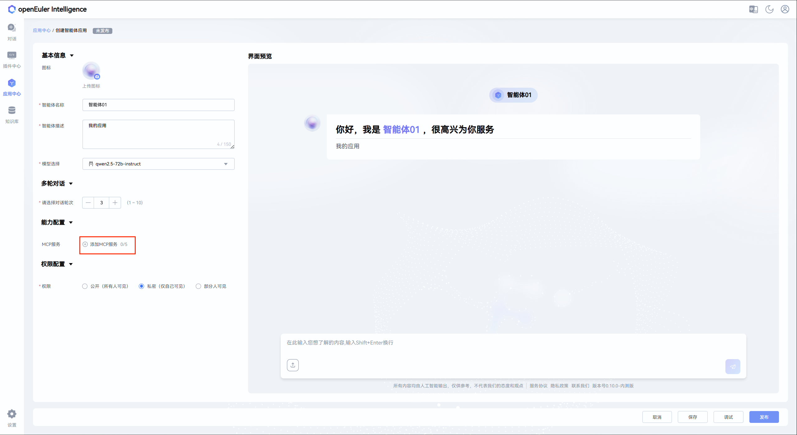
   

4. **测试 Agent 应用**
   完成 MCP 关联和信息配置后，点击右下角"测试"按钮进行功能测试
   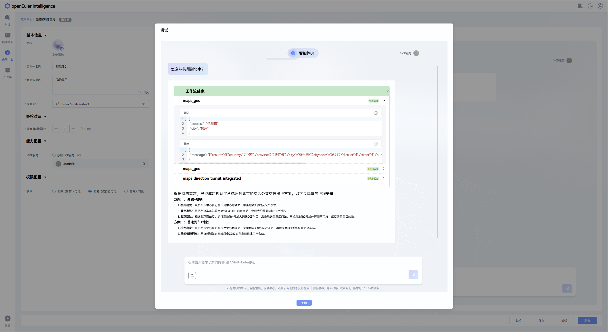

5. **发布 Agent 应用**
   测试通过后，点击右下角"发布"按钮发布应用
   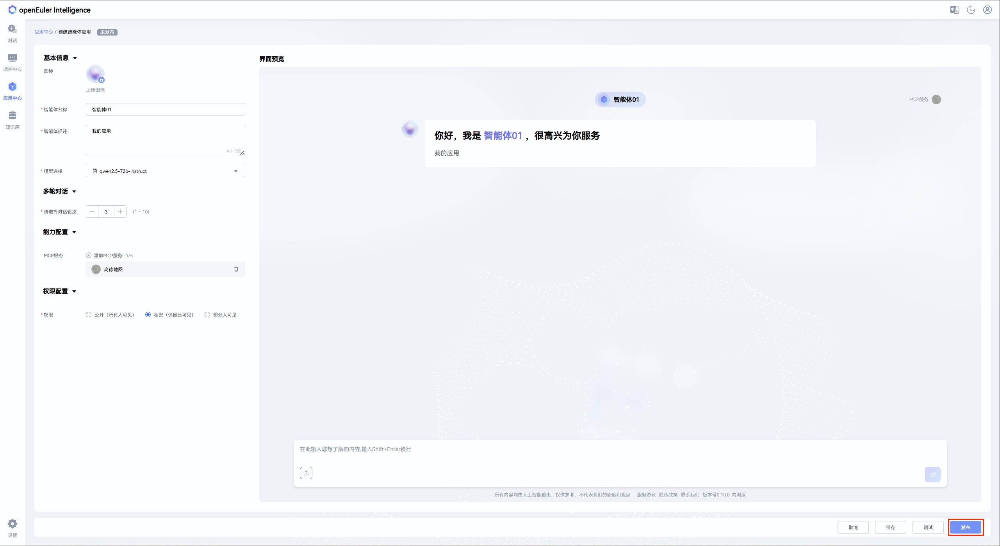

6. **使用 Agent 应用**
   发布后的应用将显示在应用市场中，双击即可使用
   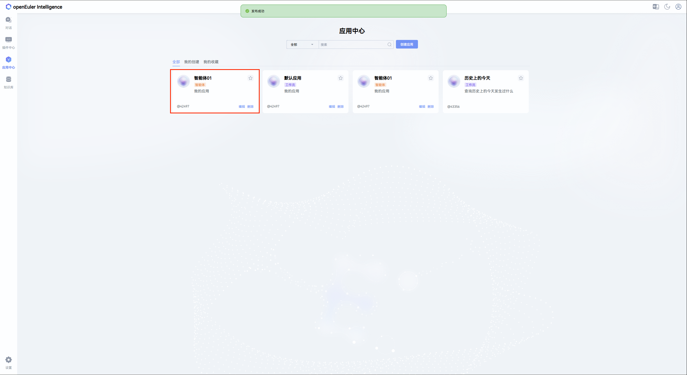

   Agent 应用有两种使用模式：

   - **自动模式**：无需用户手动确认，自动执行操作
     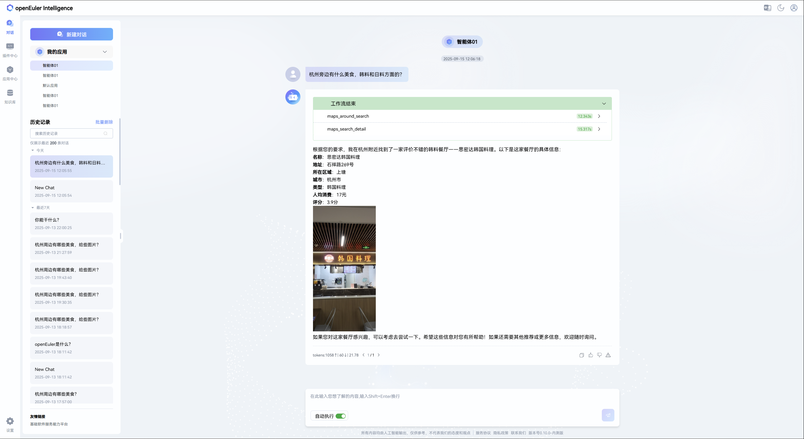

   - **手动模式**：执行前会提示风险，需用户确认后才执行
     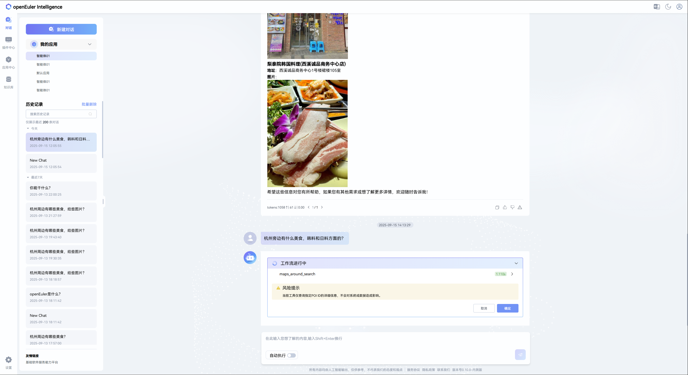

## 4. 总结

通过上述流程，用户可基于 MCP 构建并使用自定义的 Agent 应用。欢迎体验并探索更多功能场景。
