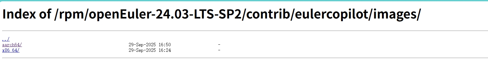
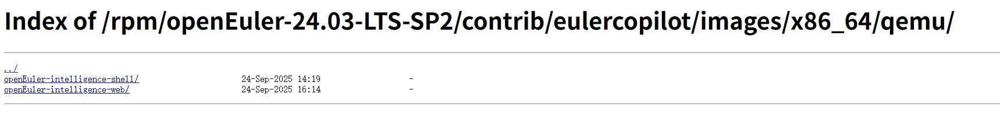
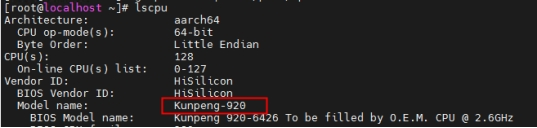

# openEuler虚拟机内嵌openEuler-intelligence使用指南

##  一、获取镜像

镜像地址：https://repo.oepkgs.net/openEuler/rpm/openEuler-24.03-LTS-SP2/contrib/eulercopilot/images/

 

 

 

根据物理机架构选择合适的版本，提供shell端和web端，包含qcow2镜像文件和对应的xml配置文件。

说明：shell端指通过shell命令行使用openEuler-intelligence，web端指通过浏览器web界面使用openEuler-intelligence。

 

## 二、准备虚拟机环境

### 2.1、准备一个支持虚拟化的物理机 

\# 通用命令：查看 CPU 是否包含虚拟化标志

~~~bash
grep -E 'vmx|svm' /proc/cpuinfo
~~~

 

输出包含 “vmx”：Intel 处理器，支持虚拟化（Intel VT-x）；

输出包含 “svm”：AMD 处理器，支持虚拟化（AMD-V）；

无任何输出：

此时可以使用lscpu查看具体的cpu版本型号并通过官网查询是否支持虚拟化

 

如Kunpeng-920支持虚拟化

 

### 2.2、安装虚拟机环境

~~~bash
命令行执行

yum -y install qemu-kvm  virt-install qemu-img bridge-utils libvirt virt-manager

 
systemctl start libvirtd

如果是aarch64架构额外执行  dnf install -y edk2-aarch64
~~~

### 2.3、加载启动虚拟机

#### 2.3.1、准备虚拟机配置文件xml

根据当前环境修改下载的配置文件

~~~bash
<memory unit='KiB'>48388608</memory> 内存大小

<disk type='file' device='disk'>

<driver name='qemu' type='qcow2' cache='none' io='native'/>

<source file='/home/iso/openEuler-intelligence-oe2403sp2-aarch64.qcow2'/> 镜像文件地址
~~~

注意事项

硬件兼容性：目标服务器 CPU 架构需与源服务器一致（如都是 x86_64）

网络配置：

默认使用静态ip 192.168.122.196

若依赖 MAC 地址绑定，需在 XML 中修改mac address字段

存储路径：目标服务器的镜像存储路径需有足够空间

其他配置可自行根据具体情况修改。

 

#### 2.3.2、加载配置文件

命令行依次执行

\#应用xml文件

~~~bash
virsh define openEuler-intelligence-oe2403sp2-aarch64.xml
~~~

 

\#查看虚拟机列表

~~~bash
virsh list –all
~~~

 

\#启动虚拟机           

~~~bash
virsh start openEuler-intelligence-oe2403sp2-aarch64   
~~~

 

\#其他常用指令

~~~bash
virsh shutdown openEuler-intelligence-oe2403sp2-aarch64 #关闭

virsh destroy openEuler-intelligence-oe2403sp2-aarch64 #强制关闭

virsh undefine openEuler-intelligence-oe2403sp2-aarch64 #取消应用
如果是aarch64架构通过<nvram>标签指定了变量存储文件，取消应用可添加—nvram参数删除EFI文件
~~~

## 三、登录虚拟机，修改大模型配置

### 3.1、登录虚拟机

虚拟机默认ip是192.168.122.196

命令行执行

~~~bash
ssh root@192.168.122.196 #密码Openeuler12#$
~~~

 

如果登录不了，通过vnc进入虚拟机查看当前ip并根据宿主机ip配置网络

命令行执行

~~~bash
virsh vncdisplay openEuler-intelligence-oe2403sp2-aarch64  
~~~

 

\#返回的端口 前面默认加59  使用VNC链接，可进入虚拟机界面 如上返回:0 ，则vnc端口为5900

 

\#修改网络ip

~~~bash
命令行执行

vi /etc/sysconfig/network-scripts/ifcfg-ens4 

具体值请根据物理机环境填写，以下为参考值

 

IPADDR=192.168.122.196

NETMASK=255.255.255.0

GATEWAY=192.168.122.1

BOOTPROTO=static

#重启网络服务

命令行执行

systemctl restart NetworkManager
~~~

### 3.2、修改配置文件，完善大模型相关配置

命令行执行

~~~bash
oi --llm-config
~~~

在如下界面依次填LLM配置和Embedding配置

 

 

## 四、使用openeuler-intelligence

### 4.1、shell端的使用

命令行执行

~~~bash
oi  #开启shell客户端开始使用
~~~

 

 

 

Shell端界面样式与使用的终端有关，上图使用的是MobaXterm终端

#### 4.1.1、界面操作快捷键

Ctrl+c: 中断

Ctrl+S: 打开设置界面

Ctrl+R: 重置对话历史

Ctrl+T: 选择智能体

Ctrl+Q: 退出终端

Tab: 在命令输入框和输出区域之间切换焦点

Esc: 退出应用程序

 

#### 4.1.2、常用命令操作

~~~bash
查看最新的日志内容:

oi --logs

设置日志级别并验证:

oi --log-level INFO

选择和设置默认智能体（仅适用于 openEuler Intelligence 后端）:

oi –agent
~~~

#### 4.1.3、常用界面操作

应用启动后，您可以直接在输入框中输入命令。如果命令无效或无法执行，应用程序将基于您的输入提供智能建议。

MCP 工具交互

当使用支持 MCP (Model Context Protocol) 的后端时，应用程序会在需要工具确认或参数输入时：

工具执行确认: 显示工具名称、风险级别和执行原因，用户可选择确认或取消

参数补全: 动态生成参数输入表单，用户填写必要信息后提交

应用程序使用内联交互模式，不会打开模态对话框，确保流畅的用户体验。

​	点击设置，弹出如下界面，支持修改后端配置、mcp工具是否自动确认

 

点击后端会切换到大模型配置，此处配置是shell端智能问答配置，如下图所示

 

点击选择智能体，弹出如下：

内置4个智能体，默认是hce运维助手

 

#### 4.1.4、其他说明

Shell端readme.md链接：[README.md · openEuler/euler-copilot-shell - 码云 - 开源中国](https://gitee.com/openeuler/euler-copilot-shell/blob/dev/README.md)

shell端部署&使用手册：[docs/部署 & 使用手册.md · openEuler/euler-copilot-shell - 码云 - 开源中国](https://gitee.com/openeuler/euler-copilot-shell/blob/dev/docs/部署 & 使用手册.md)

 

**默认智能体说明**

##### 4.1.4.1、智能问答 

基于大模型进行问答

 

##### 4.1.4.2、oe 运维助手

oe运维助手,用于诊断oe环境和执行shell命令

 

##### 4.1.4.3、智能运维

基于systrace对ai训练进行运维

需要在ai训练机器上安装systrace进行数据采集，在本机上修改对应配置才能使用

详见：

数据采集 ：[docs/0.quickstart.md · openEuler/sysTrace - Gitee.com](https://gitee.com/openeuler/sysTrace/blob/master/docs/0.quickstart.md)

配置修改 ：https://gitee.com/openeuler/sysTrace/blob/master/systrace_mcp/README.md

 

##### 4.1.4.4、智能调优

基于EulerCopilot Tune通过采集系统、微架构、应用等维度的指标数据，结合大模型和定制化的prompt工程，针对不同应用的可调参数给出可靠的参数推荐，同时根据推荐的参数运行benchmark，与baseline做对比并计算出推荐参数对应用性能的提升值。

需要修改配置文件针对具体调优场景才能使用

详见：https://gitee.com/openeuler/A-Tune/blob/euler-copilot-tune/README.md

 

### 4.2、web端虚拟机的使用

下载并配置启动web端虚拟机

使用可以访问到虚拟机ip的浏览器进行openEuler Intelligence的使用，如果没有可以直接访问虚拟机的浏览器，可以通过在物理机上nginx代理端口的方式进行访问。

 

#### 4.2.1、物理机配置nginx代理虚拟机端口（可选）

##### 4.2.1.1、在物理机上安装nginx

命令行执行 dnf install nginx -y

 

##### 4.2.1.2、配置nginx

修改 /etc/nginx/nginx.conf 文件，代理虚拟机的8080端口和8000端口到物理机的对应端口上，以下为配置示例。

~~~shell
#在nginx.conf的http块中新增2个server块
server{
listen 8080;
listen [::]:8080;
server_name _;
location / {
  proxy_pass http://192.168.122.196:8080/; #此处ip为虚拟机ip
  proxy_set_header Host $host;
  proxy_set_header X-Real-IP $remote_addr;
  proxy_set_header X-Forwarded-For $proxy_add_x_forwarded_for;
  proxy_set_header X-Forwarded-Proto $scheme;
  # 超时设置
  proxy_connect_timeout 60s;
  proxy_send_timeout 60s;
  proxy_read_timeout 60s;
  # 缓冲区设置
  proxy_buffering on;
  proxy_buffer_size 16k;
  proxy_buffers 4 64k;
  proxy_busy_buffers_size 128k;
  # WebSocket支持
  proxy_http_version 1.1;
  proxy_set_header Upgrade $http_upgrade;
  proxy_set_header Connection "upgrade";
  # 跟随后端的重定向
  proxy_redirect off;
}
error_page 404 /404.html;
location = /404.html {
  root /usr/share/nginx/html;
}
error_page 500 502 503 504 /50x.html;
location = /50x.html {
  root /usr/share/nginx/html;
}
}
server{
listen 8000;
listen [::]:8000;
server_name _;
location / {
  proxy_pass http://192.168.122.196:8000/; #此处ip为虚拟机ip
  proxy_set_header Host $host;
  proxy_set_header X-Real-IP $remote_addr;
  proxy_set_header X-Forwarded-For $proxy_add_x_forwarded_for;
  proxy_set_header X-Forwarded-Proto $scheme;
  # 超时设置
  proxy_connect_timeout 60s;
  proxy_send_timeout 60s;
  proxy_read_timeout 60s;
  # 缓冲区设置
  proxy_buffering on;
  proxy_buffer_size 16k;
  proxy_buffers 4 64k;
  proxy_busy_buffers_size 128k;
  # WebSocket支持
  proxy_http_version 1.1;
  proxy_set_header Upgrade $http_upgrade;
  proxy_set_header Connection "upgrade";
  # 跟随后端的重定向
  proxy_redirect off;
}
error_page 404 /404.html;
location = /404.html {
  root /usr/share/nginx/html;
}
error_page 500 502 503 504 /50x.html;
location = /50x.html {
  root /usr/share/nginx/html;
}
}
~~~

##### 4.2.1.3、启动nginx

命令行执行

~~~bash
 systemctl start nginx
~~~

查看nginx运行状态，如下启动成功

 

#### 4.2.2、修改配置文件

修改/etc/Euler-copilot-framework/config.toml文件

 

把host和login_api的127.0.0.1替换成虚拟机或代理的物理机ip地址

保存退出后，重启服务 

~~~bash
systemctl restart oi-runtime
~~~

#### 4.2.3、使用oi –-llm-config修改大模型参数，参考shell端使用

#### 4.2.4、浏览器访问authhub web进行ip调整

##### 4.2.4.1、浏览器打开authhub web，访问地址为物理机/虚拟机的ip:8000。以下浏览器输入的ip都指可以直接访问虚拟机的ip或通过物理机代理的物理机ip。

 

浏览器访问ip:8000/authhub/

 

登录authhub平台，账密administrator changeme

可以看到已有一个EulerCopilot，点击进入详情

修改应用地址和登录回调地址的ip，从127.0.0.1改成虚拟机或代理的物理机ip地址

修改后点击保存

浏览器打开http://ip:8080

 

点击登录，输入账号密码 openEuler Openeuler12

成功后登录

 

点击插件中心，点击mcp服务，可以查看默认安装的mcp服务

 

点击应用中心，可以查看默认应用

 

点击任意应用，跳转到对话，开始对话

 

如咨询磁盘使用情况

 

oi会识别用户信息组织mcp工具，此处为提示是否执行mcp工具，支持单步点击queren或自动执行

 

得到结果

 

 

