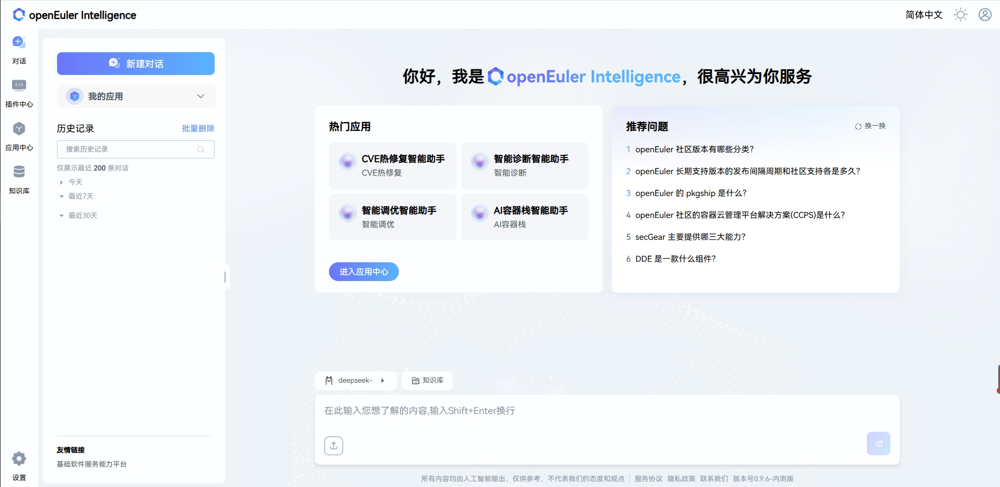

# openEuler Intelligence 智能助手部署指南

**版本信息**  
当前版本：v0.9.6  
更新日期：2025年7月9日

## 产品概述

openEuler Intelligence 是一款智能问答工具，使用 openEuler Intelligence 可以解决操作系统知识获取的便捷性问题，并为 OS 领域模型赋能开发者及运维人员。作为操作系统知识获取工具，它支持多种生产力工具（如 A-Ops/A-Tune/x2openEuler/EulerMaker/EulerDevOps/StratoVirt/iSulad 等），将传统命令交付方式进化为自然语义交互，结合智能体任务规划能力，显著降低开发和使用操作系统特性的门槛。

本指南提供基于自动化脚本的 openEuler Intelligence 智能助手系统部署说明，支持一键自动部署和手动分步部署两种方式。

## 组件介绍

| 组件                      | 端口                  | 说明                |
|--------------------------|-----------------------|-------------------|
| euler-copilot-framework  | 8002 (内部端口)       | 智能体框架服务      |
| euler-copilot-web        | 8080                 | 智能体前端界面      |
| euler-copilot-rag        | 9988 (内部端口)       | 检索增强服务        |
| authhub-backend-service  | 11120 (内部端口)      | 鉴权服务后端        |
| authhub-web-service      | 8000                 | 鉴权服务前端        |
| redis                    | 6379 (内部端口)       | Redis 数据缓存     |
| minio                    | 9000/9001 (内/外部端口) | minio 对象存储库   |
| mongo                    | 27017 (内部端口)      | mongo 数据库       |
| openGauss                | 5432 (内部端口)       | 向量数据库          |
| secret_inject            | 无                   | 配置文件安全复制工具 |

## 软件要求

| 类型     | 版本要求                          | 说明                                  |
|----------|----------------------------------|---------------------------------------|
| 操作系统 | openEuler 22.03 LTS 及以上版本    | -                                     |
| K3s      | >= v1.30.2 (带 Traefik Ingress)  | 提供轻量级 Kubernetes 集群            |
| Helm     | >= v3.15.3                      | Kubernetes 包管理工具                 |
| python   | >=3.9.9                         | 模型下载和安装的运行环境              |

## 硬件规格

| 硬件资源   | 最小配置                 | 推荐配置               |
|------------|--------------------------|------------------------|
| CPU        | 4 核心                  | 16 核心及以上          |
| RAM        | 4 GB                    | 64 GB                 |
| 存储       | 32 GB                   | 64 GB                 |
| 大模型名称 | qwen2.5-14B              | qwen2.5-32B           |
| 显存 (GPU) | NVIDIA RTX A4000 8GB    | NVIDIA A100 80GB * 2   |

**关键说明**：

- 纯 CPU 环境建议调用 OpenAI 接口或使用自带模型部署
- 已有 Kubernetes 集群环境 (version >= 1.28) 无需单独安装 k3s

## 部署视图


## 快速开始

### 1. 获取部署脚本

从 openEuler Intelligence 的官方 Git 仓库 [euler-copilot-framework](https://gitee.com/openeuler/euler-copilot-framework) 下载最新的部署仓库

```bash
cd /home
git clone https://gitee.com/openeuler/euler-copilot-framework.git -b master
cd euler-copilot-framework/deploy/scripts
```

### 2. 部署 openEuler Intelligence

#### **一键部署**

一键自动部署模式主要适用于**没有预先部署大语言模型资源**的用户：

1. **自动安装和配置所有必需组件**：
   - 部署轻量级Kubernetes发行版k3s
   - 安装包管理工具helm
   - 部署Ollama模型服务框架
   - 下载并部署Deepseek大语言模型（deepseek-llm-7b-chat）
   - 下载并部署Embedding模型（bge-m3）
   - 安装数据库、Authhub认证服务和openEuler Intelligence应用

2. **支持多种硬件环境**：
   - 可在纯CPU环境运行
   - 如有GPU资源会自动利用加速推理
   - 自动配置模型接口供openEuler Intelligence调用

3. **简化部署流程**：
   - 无需手动配置模型端点
   - 自动设置所有依赖关系
   - 适合快速体验和测试环境

```bash
bash deploy.sh
```

```text
==============================
        主部署菜单
==============================
0) 一键自动部署  # 自动安装所有组件，包括Ollama和模型（推荐新手）
1) 手动分步部署
2) 重启服务
3) 卸载所有组件并清除数据
4) 退出程序
==============================
请输入选项编号（0-3）: 0
```

#### 分步部署

分步部署模式主要适用于**已有部署好的大语言模型接口和embedding模型接口**的场景。使用此模式前，用户需要：

1. **预先准备模型服务**：
   - 确保大语言模型服务已部署并可访问
   - 确保embedding模型服务已部署并可访问
   - 获取各模型的API端点URL和认证密钥

2. **配置values.yaml文件**：
   - 在部署前编辑values.yaml文件，预先填写已有的模型服务信息
   - 配置问答模型、函数调用模型和embedding模型的具体参数
   - 配置示例：

```yaml
models:
  # 用于问答的大语言模型；需要OpenAI兼容的API
  answer:
    # [必需] API端点URL（请根据API提供商文档确认是否包含"v1"后缀）
    endpoint: https://$ip:$port/v1
    # [必需] API密钥；默认为空
    key: sk-123456
    # [必需] 模型名称
    name: qwen3-32b
    # [必需] 模型最大上下文长度；推荐>=8192
    ctxLength: 8192
    # 模型最大输出长度，推荐>=2048
    maxTokens: 8192
  # 用于函数调用的模型；推荐使用特定的推理框架
  functionCall:
    # 推理框架类型，默认为ollama
    # 可用框架类型：["vllm", "sglang", "ollama", "openai"]
    backend: openai
    # [必需] 模型端点；请根据API提供商文档确认是否包含"v1"后缀
    # 留空则使用与问答模型相同的配置
    endpoint: https://$ip:$port/v1
    # API密钥；留空则使用与问答模型相同的配置
    key: sk-123456
    # 模型名称；留空则使用与问答模型相同的配置
    name: qwen3-32b
    # 模型最大上下文长度；留空则使用与问答模型相同的配置
    ctxLength: 8192
    # 模型最大输出长度；留空则使用与问答模型相同的配置
    maxTokens: 8192
  # 用于数据嵌入的模型
  embedding:
    # 推理框架类型，默认为openai
    # [必需] Embedding API类型：["openai", "mindie"]
    type: openai
    # [必需] Embedding URL（需要包含"v1"后缀）
    endpoint: https://$ip:$port/v1
    # [必需] Embedding模型API密钥
    key: sk-123456
    # [必需] Embedding模型名称
    name: BAAI/bge-m3
```

3. **按需选择部署步骤**：
   - 需跳过无需部署的步骤3、步骤4、步骤5；
   - 只部署其余必要的应用和组件
   - 适合生产环境和已有基础设施的用户

```bash
bash deploy.sh
```

```text
==============================
        主部署菜单
==============================
0) 一键自动部署 - 自动安装所有组件，包括Ollama和模型（推荐新手）
1) 手动分步部署 - 已有模型服务时使用，可自定义配置
2) 重启服务
3) 卸载所有组件并清除数据
4) 退出程序
==============================
请输入选项编号（0-3）: 1
```

```text
==============================
       手动分步部署菜单
==============================
1) 执行环境检查脚本
2) 安装k3s和helm
3) 安装Ollama - 如已有模型服务可跳过
4) 部署Deepseek模型 - 如已有模型服务可跳过
5) 部署Embedding模型 - 如已有模型服务可跳过
6) 安装数据库
7) 安装AuthHub
8) 安装openEuler Intelligence
9) 返回主菜单
==============================
请输入选项编号（1-9）:
```

**选择建议**：

- **新手用户或试用环境**：选择**一键自动部署**

- **现有模型服务**：选择**手动分步部署**，并预先配置values.yaml文件

#### 重启服务

```bash
bash deploy.sh
```

```text
==============================
        服务重启菜单
==============================
可重启的服务列表：
1) authhub-backend
2) authhub
3) framework
4) minio
5) mongo
6) mysql
7) opengauss
8) rag
9) rag-web
10) redis
11) web
12) 返回主菜单
==============================
请输入要重启的服务编号（1-12）:
```

#### 卸载所有组件

```bash
sudo ./deploy.sh
```

```text
==============================
        主部署菜单
==============================
0) 一键自动部署
1) 手动分步部署
2) 卸载所有组件并清除数据
3) 退出程序
==============================
请输入选项编号（0-3）: 2
```

**运维命令**：

```bash
# 查看服务状态
kubectl get pod -n euler-copilot

# 查看组件日志
kubectl logs $pod_name -n euler-copilot

# 大模型配置修改
cd /home/euler-copilot-framework/deploy/chart/euler-copilot
vim values.yaml
helm upgrade euler-copilot -n euler-copilot .

# 集群事件检查
kubectl get events -n euler-copilot

# 镜像查看
k3s crictl images

# 镜像卸载
k3s crictl rmi $image_id

# 镜像导入
k3s ctr image import $image_tar
```

## 验证安装

恭喜您，**openEuler Intelligence** 已成功部署！为了开始您的体验，请在浏览器中输入 `https://$host:30080` 访问 openEuler Intelligence 的网页：

1. 首次访问点击 **立即注册** 创建账号
2. 完成登录流程




## 构建专有领域智能问答

知识库专注于文档的高效管理和智能解析，支持包括xlsx,pdf,doc,docx,pptx,html,json,yaml,md,zip以及txt在内的多种文件格式。本平台搭载的先进文档处理技术，结合openEuler Intelligence的强大检索功能，旨在为您提供卓越的智能问答服务体验。

1. **进入知识库管理系统**：
   - 点击知识库
   - 新建团队，点击确定
   - 点击新建资产库或导入资产库

2. **配置资产库**
   - 点击对话
   - 点击模型
   
   - 点击知识库
   
   - 选择资产库
   

## 附录

### 大模型准备

#### GPU 环境（基于 vLLM）

1. 安装依赖：
   - Python >= 3.10
   - CUDA >= 11.7
   - [GPU 驱动安装](https://www.nvidia.cn/drivers/lookup/)

2. 下载模型：

   ```bash
   huggingface-cli download --resume-download Qwen/Qwen1.5-14B-Chat --local-dir Qwen1.5-14B-Chat
   ```

3. 启动服务：

   ```bash
   # 启动 controller
   screen -S control
   python3 -m fastchat.serve.controller
   Ctrl+A+D  # 后台运行

   # 启动 API 服务
   screen -S api
   python3 -m fastchat.serve.openai_api_server --host 0.0.0.0 --port 30000 --api-keys sk-123456
   Ctrl+A+D  # 后台运行

   # 启动 worker
   screen -S worker
   pip install fschat vllm
   python3 -m fastchat.serve.vllm_worker --model-path /root/models/Qwen1.5-14B-Chat/ --model-name qwen1.5 --num-gpus 8 --gpu-memory-utilization=0.7 --dtype=half
   Ctrl+A+D  # 后台运行
   ```

4. 修改配置：

   ```bash
   vim /home/euler-copilot-framework/deploy/chart/euler_copilot/values.yaml
   ```

5. 更新服务：
  
   ```bash
   # 更新服务
   helm upgrade -n euler-copilot euler-copilot .
   ```

   ```bash
   # 重启framework服务
   kubectl get pod -n euler-copilot
   ```bash
   kubectl delete pod framework-deploy-65b669fc58-q9bw7 -n euler-copilot
   ```

6. curl 大模型接口

   ```bash
   # curl大模型接口
    curl http://localhost:11434/v1/chat/completions   -H "Content-Type: application/json" -H "Authorization: Bearer sk-123456"   -d '{ "model": "deepseek-llm-7b-chat:latest", "messages":[ { "role": "system", "content": "你是情感分析专家，你的任务是xxxx"}, { "role": "user", "content": "你好" }], "stream": true, "n": 1, "max_tokens": 8192 }'
   ```

#### NPU 环境

参考：[昇腾镜像仓库](https://www.hiascend.com/developer/ascendhub) | [NPU部署案例](./NPU推理服务器部署指南.md)

### FAQ

#### 1. 解决 Hugging Face 连接错误

```bash
urllib3.exceptions.NewConnectionError: <urllib3.connection.HTTPSConnection object>: Failed to establish a new connection: [Errno 101] Network is unreachable
```

**解决方案**：

- 更新 `huggingface_hub` 包到最新版本。

  ```bash
  pip3 install -U huggingface_hub
  ```

- 如果网络问题依旧存在，可以尝试使用镜像站点作为端点。

  ```bash
  export HF_ENDPOINT=https://hf-mirror.com

#### 2. 在 RAG 容器中调用问答接口

```bash
curl -k -X POST "http://localhost:9988/kb/get_answer" \
     -H "Content-Type: application/json" \
     -d '{"question": "您的问题", "kb_sn": "default_test", "fetch_source": true}'
```

#### 3. 解决 helm upgrade 错误

```text
Error: UPGRADE FAILED: Kubernetes cluster unreachable
```

**解决方案**：

```bash
echo "export KUBECONFIG=/etc/rancher/k3s/k3s.yaml" >> /root/.bashrc
source /root/.bashrc
```

#### 4. 查看 Pod 日志失败

**解决方案**：

```bash
cat /etc/systemd/system/k3s.service.env  # 确认 no_proxy 包含本机 IP
```

#### 5. GPU 环境流式回复问题

**解决方案**：

```bash
pip install pydantic==1.10.13
# 请求中将 "stream": true 改为 false
```

#### 6. sglang 模型部署

```bash
conda create --prefix=/root/py310 python==3.10.14
conda activate /root/py310
pip install "sglang[all]==0.3.0"
pip install flashinfer -i https://flashinfer.ai/whl/cu121/torch2.4/

python -m sglang.launch_server \
    --served-model-name Qwen2.5-32B \
    --model-path Qwen2.5-32B-Instruct-AWQ \
    --host 0.0.0.0 \
    --port 8001 \
    --api-key "sk-12345" \
    --mem-fraction-static 0.5 \
    --tp 8
```

#### 7. 获取 Embedding

```bash
curl -k -X POST http://localhost:11434/v1/embeddings \
     -H "Content-Type: application/json" \
     -d '{"input": "The food was delicious...", "model": "bge-m3", "encoding_format": "float"}'
```

#### 8. 生成证书

为了生成自签名证书，首先下载 [mkcert](https://github.com/FiloSottile/mkcert/releases)工具，然后运行以下命令：

```bash
mkcert -install
mkcert example.com 
```

最后，将生成的证书和私钥拷贝到 values.yaml 中, 并应用至 Kubernetes Secret.

```bash
vim /home/euler-copilot-framework_openeuler/deploy/common/chart_ssl/traefik-secret.yaml
```

```bash
kubectl apply -f traefik-secret.yaml
```

#### 9. 资源不足时，所有pod状态pending？

   ```bash
   kubectl top nodes
   df -h  # 确保磁盘空间 >30%
   ```

  参考该链接挂载空间较大的磁盘[How to move k3s data to another location](https://mrkandreev.name/snippets/how_to_move_k3s_data_to_another_location/)

#### 10. 无法插网线的离线环境安装k3s后启动失败？

k3s无法找到route和ipv6_route，报错："no default routes found in '/proc/net/route' or '\proc/net\ipv6_route'"，无法使用k3s，可以通过创建创建虚拟网络接口配置解决

**解决办法：**

```bash
# 注意：服务器器显示时间需要和当前网络时间保持一致
mkdir -p /etc/systemd/system/k3s.service.d/
cat <<EOF | sudo tee /etc/systemd/system/k3s.service.d/override.conf
[Service]
ExecStartPre=/sbin/ip link add dummy0 type dummy
ExecStartPre=/sbin/ip addr add 203.0.113.254/31 dev dummy0
ExecStartPre=/sbin/ip link set dummy0 up
ExecStartPre=/sbin/ip route add default via 203.0.113.254 dev dummy0
EOF
systemctl daemon-reload
systemctl restart k3s
```

#### 11. x86架构且CPU型号E系列的服务器知识库文件解析至71%失败？

opengauss数据库的指令集加速特性默认开启，该特性约束为docker镜像的opgs的x86需要支持AVX512指令集，arm需要支持neon指令集。由于x86架构且CPU型号E系列的服务器是低功耗x86计算，仅支持AVX2指令集，不支持AVX512，导致数据插入出现报错。

**解决办法：**
由于不加指令集性能会受限，x86环境下如果环境不支持指令集加速，使用l2距离构建索引并查询，需要单独构建rag镜像，不能确保准确率是否会下降，建议更换支持AVX512的CPU型号进行部署。

```bash
# 查看是否支持avx512：
cat /proc/cpuinfo| grep avx512
lscpu | grep -i avx
```

#### 12. 工作流理解上下文耗费时间很久？

大模型使用带reasoning的模型，例如deepseek-r1-distill-qwen32B

**解决办法：**

更换无思考过程的模型，不支持使用Deepseek R1系列和Qwen3系列
